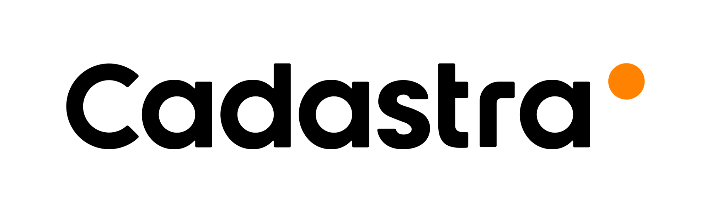

<p align="center">

</p>  
<h1 align="center"><strong></strong></h1>
<h1 align="center"><strong>Desenvolvedor Cadastra</strong></h1>
<br>
<p align="center">
  <a href="#-project">Projeo</a>&nbsp;&nbsp;&nbsp;|&nbsp;&nbsp;&nbsp;
  <a href="#installation">Instalação</a>&nbsp;&nbsp;&nbsp;|&nbsp;&nbsp;&nbsp;
  <a href="#-technologies">Tecnologias</a>
  &nbsp;&nbsp;&nbsp;|&nbsp;&nbsp;&nbsp;
  <a href="#-deploy">Deploy</a>
</p>

## 💻 Projeto


<p> Escolhi utilizar o Next.js para o desenvolvimento do projeto para mostrar uma habilidade, além do fato que o Next facilita a reutilização de componentes, facilitando a manutenção. Organizei meu projeto seguindo boas práticas de Clean Code, como: Nomenclatura consistente, Componentização e Estrutura de Pastas.

Optei por utilizar Tailwind CSS ao invés de Less ou Sass como um fator positivo, para mostrar mais uma tecnologia que tenho habilidade, tendo em vista que o Tailwind tem uma maior dificuldade e não se encaixa nas bibiliotecas que fornecem componentes com layout prontos que não eram permitido usar como Bootstrap, Foundation Css, Semantic ui ou semelhantes;

Além disso, criei um hook personalizado chamado useLocalStorage para gerenciar dados armazenados localmente no navegador, para as compras não saem do carrinho se a página for recarregada.

Adicional: Fiz o deploy da aplicação, para demonstrar mais uma habilidade e p Carrinho de compras funcional, pode ser testado ao clicar no icone de bolsa, no header da aplicação, como mostra no exemplo abaixo.
</p>

<br>


<br>
<br>

## 🚀 Deploy
 -  https://desenvolvedor-cadastra.canale.dev/

 - O deploy dessa aplicação foi feito com Github Pages

<br>

## Instalação

- Importante: Você deve ter instalado o Next.js e o Git

```bash
# clonar o repositório
$ git clone git@github.com:airton-canale/desenvolvedor-cadastra.git

$ cd desenvolvedor-cadastra

# Instalar dependências
$ npm install

# Iniciar API local
$ npm run server

# Iniciar projeto
$ cd src
$ npm run dev
```
- E entre no seu navegador usando http://localhost:3000


## 🚀 Tecnologias

Este projeto foi desenvolvido utilizando as seguintes tecnologias:

-  **NextJS**
-  **Tailwind**
-  **JavaScript**
-  **TypeScript**

<br>
<br>
<br>
<br>
<br>
<br>
<br>
<br>  

# Venha ser um desenvolvedor da Cadastra

Olá! Somos a Cadastra, uma Next-Gen Company que oferece soluções globais em marketing, tecnologia, estratégia de negócios, commerce, dados e analytics. Este desafio é voltado para o nosso Centro de Excelência (COE) de Commerce, especializado em implantação, migração, evolução e otimização de e-commerce.  Contamos com escritórios em 5 países, mas num formato de trabalho 100% home office.

Estamos em busca de Pessoas Desenvolvedoras `Front-end`, com sólidos conhecimentos em HTML, CSS e TS para projetar interfaces e entregar a melhor experiência para os consumidores visando sempre a otimização do código e agilidade no desenvolvimento.

## O que procuramos

### Requisitos Obrigatórios

- Html5, css3;
- Javascript/Typescript;
- Consumo de APIs.
- Versionamento Git;
- Grunt/gulp;
- Sass/less;
- Nodejs
- Sites responsivos;
- Iniciativa, criatividade e colaboração;
- Boas práticas: reutilização de código, semântica, organização, performance.

### Desejáveis:

- Experiência com algum CMS
- Conhecimento/Experiência em Vtex
- Nodejs

----

## Como se candidatar a vaga

- [Crie um fork desse projeto;](https://github.com/Cadastra-Next-Gen-Company/desenvolvedor-cadastra/fork)
- No seu fork, codifique o layout seguindo as instruções abaixo;
- Atualize o readme com as instruções necessárias para rodar o seu código;
- Adicione também seu e-mail de contato ao readme do projeto ( caso seu e-mail do github esteja privado )
- envie para [vinicius.delfino@cadastra.com](mailto:vinicius.delfino@cadastra.com?subject=Vaga%20DEV%20-%20Cadastra) com cópia para [andresa.klein@cadastra.com](mailto:andresa.klein?subject=Vaga%20DEV%20-%20Cadastra)
 

**obs.**: link do projeto [github.com/Cadastra-Next-Gen-Company/desenvolvedor-cadastra](https://github.com/Cadastra-Next-Gen-Company/desenvolvedor-cadastra)

### Instruções para o teste

O layout se encontra no [figma](https://www.figma.com/file/Z5RCG3Ewzwm7XIPuhMUsBZ/Desafio-Cadastra?type=design&node-id=0%3A1&mode=design&t=A0G2fRjMSrcQjchw-1).

### Dependências

O projeto possui um setup pronto no qual há a necessidade de possuir o nodejs instalado na versão 14 ou superior.

Para instalar as dependências só é preciso executar o comando: `npm install`

O dar start no server e nos processos para desenvolvimento é necessário rodar o comando: `npm start `

Uma ver que o comando é dado ele irá levantar 2 servidores, sendo eles:
 - um para acessar o front-end que roda na porta 3000. No qual pode ser acessado pela url: http://localhost:3000
 - um para o json-server que irá export uma api com a lista de produtos que roda na porta 5000. Para acessar os produtos é na url:  http://localhost:5000/products

### Objetivo

O objetivo desse desafio é avaliar a seus conhecimentos fundamentais de front end, por isso pedimos que não utilize nenhum framework, porem caso deseje utilizar frameworks como react, é possível adicionar ao setup.
### Obrigatório

- HTML5 e CSS3
- Typescript
- Requisição a API para obter os produtos
- Funcionalidade: Filtrar produtos por cor, tamanho e preço.
- Funcionalidade: Adicionar produto ao carrinho.
- Funcionalidade: Carregar mais produtos.
- Não utilizar Bootstrap, Foundation Css, Semantic ui ou semelhantes ;
- Responsividade

#### Bônus

- Typescript com clean code
- Adição de processo no gulp para otimizar imagens

##### Dúvidas: [vinicius.delfino@cadastra.com](mailto:vinicius.delfino@cadastra.com?subject=Dúvida%20Vaga%20DEV%20-%20Cadastra)
